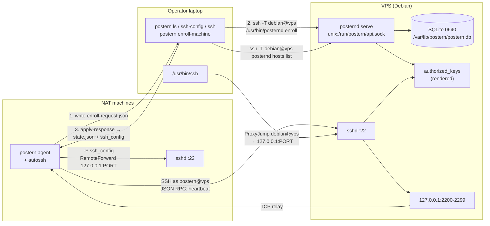
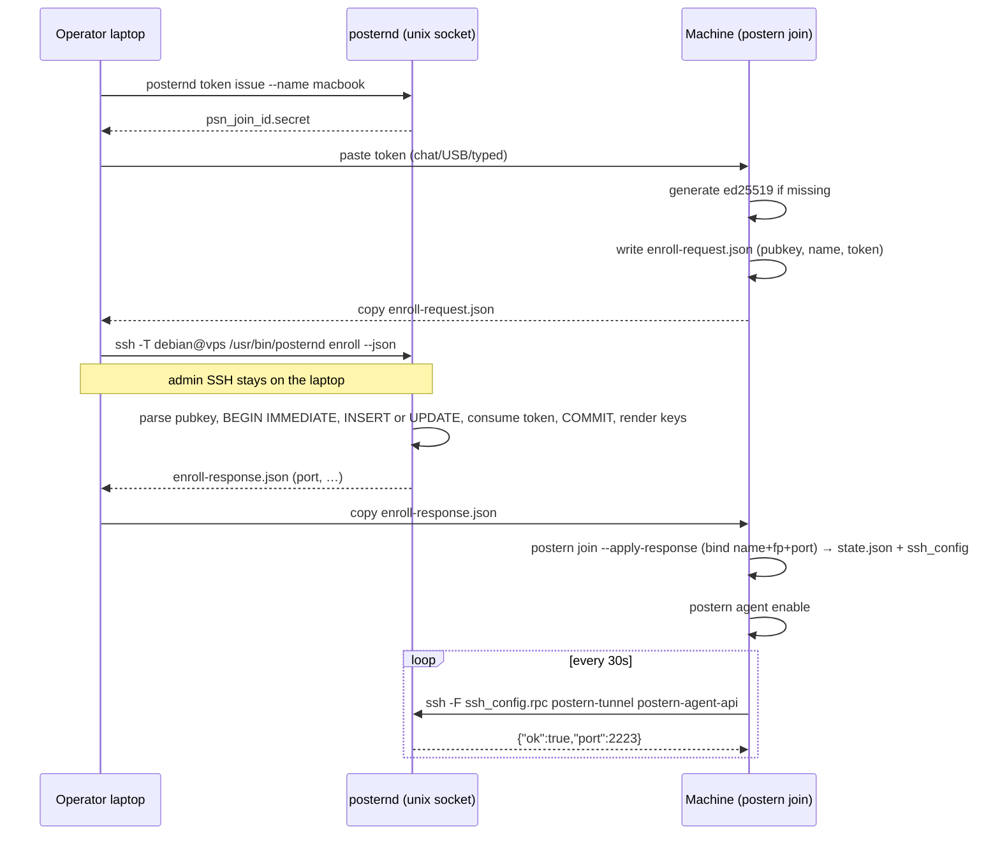

# Postern: Reverse SSH Tunnel Control Plane

| Field | Value |
|---|---|
| **Document title** | Postern — reverse SSH tunnel control plane |
| **Author** | Postern authors |
| **Date** | 2026-09-06 |
| **Status** | Draft |
| **Repo / CLI** | `postern` |
| **Scope** | MVP (single operator, single VPS, tens of machines) |
| **Language** | Go 1.23+ (confirmed) |
| **Companion** | Data plane is stock OpenSSH + autossh; this document specifies only the control plane and how it drives that data plane |
| **Revision** | 3 — enroll UPSERT, `postern ssh -F`, ssh_config refresh from `state.json`, `0.0.0.0` listen probe, apply-response binding. Language locked to Go. |

---

## Overview

Home and laptop machines sit behind NAT. A VPS has a static IP. The reliable trick is a reverse SSH tunnel (`autossh -R 127.0.0.1:PORT:127.0.0.1:22`), after which a client `ProxyJump`s through the VPS onto that loopback port. The trick works; it does not scale as notes in someone’s head: which machine owns port 2223, whether the tunnel is up, which login user that Mac uses, how a phone gets a current `ssh_config`.

Postern is a small control plane for that existing data plane. It is **not** a VPN: no tun device, no default-route grab, no fight with another VPN on the same machine. Encryption remains SSH. The VPS remains a TCP relay, not a TLS terminator.

The system is three pieces, one Go module, two binaries:

- **`posternd`** on the VPS: SQLite registry, port allocator, join-token issuer, `authorized_keys` renderer, liveness.
- **`postern` agent** on each reachable machine: generate a dedicated tunnel key, produce an enroll request, spawn autossh, heartbeat.
- **`postern` client** on a laptop (and later a phone): `ls`, print/write `ssh_config`, thin `ssh` wrapper.

Control-plane traffic never needs a public HTTP port. `posternd` listens on a Unix socket on the VPS **only** (no TCP bind in MVP). Admins talk to it with `posternd` subcommands (locally, or via their existing admin SSH **from the operator laptop**). Agents talk to it with a restricted JSON RPC over SSH as the dedicated `postern` tunnel user. Enroll is **split**: the NAT machine never needs the admin SSH key.

---

## Background & Motivation

### Current state

The operator already has:

- A Debian VPS with `sshd` on `:22` and a static IP / DNS name.
- One or more machines behind NAT whose `sshd` listens on `127.0.0.1:22` (or `:22` on all interfaces; Postern always targets loopback on the machine side).
- Informal reverse tunnels: a remembered port, an autossh one-liner, a hand-edited `~/.ssh/config`.

This collides with a second requirement: **another VPN must keep the rest of the routing table**. Tailscale / WireGuard / a corporate VPN already wants a tun device and (often) the default route. Postern must not.

### Pain points

| Pain | Why it hurts |
|---|---|
| Port ownership is tribal knowledge | Two laptops reuse 2223; the second `ExitOnForwardFailure`s forever |
| No liveness | `ssh macbook` hangs; the operator `ss`es the VPS by hand |
| Username drift | Mac local user is `neo`, Linux box is `debian`; config bitrots |
| Config distribution | Phone / second laptop has a stale `Host` stanza |
| Key sprawl | Personal SSH keys used for tunnels; no `permitlisten` lock |

### Why not Tailscale (or similar)

Tailscale is a VPN. This machine already needs another VPN. Postern only needs **one outbound TCP connection** to the VPS (SSH). The other VPN can keep every other route. Overlay IPs, MagicDNS, and full-tunnel routing are explicitly out of scope.

Prior art we are *not* cloning: frp, rathole, cloudflared, ngrok, Teleport. Those terminate TLS, expose 0.0.0.0, or replace SSH. Postern only books loopback ports and prints `ssh_config`.

---

## Goals & Non-Goals

### Goals (MVP)

- Register a machine: unique short name, login user, key fingerprint, optional tags.
- Allocate a free **IPv4 loopback** port on the VPS in a fixed range (default 2200–2299); reuse on re-enroll of the same name + same key.
- Heartbeat; expire to offline. `postern ls` shows **TUNNEL** (LISTEN) and **AGENT** (heartbeat) as separate columns.
- Emit `~/.ssh/config` `Host` stanzas (`ProxyJump` + loopback `Port`) with managed-block markers; `postern ssh-config --write` ships.
- `postern ssh <name>` as a thin wrapper around `/usr/bin/ssh`.
- Enable/disable the local tunnel service (LaunchAgent on macOS, systemd --user on Linux).
- Lock down the VPS tunnel user: keys only, no TTY, no X11, no agent forwarding, `GatewayPorts no`, `PermitOpen none`, per-key `permitlisten="127.0.0.1:PORT"`.
- Single-operator, single-VPS, tens of machines. Register via Unix socket in **< 100 ms**. SQLite is enough.

### Non-goals (MVP and this document)

- Overlay IPs, DNS magic, full-tunnel routing, UDP hole punching.
- Binding forwarded ports on `0.0.0.0` / public HTTP publishing (Caddy + extra `-R` for HTTP is a **different** document).
- Replacing SSH, terminating TLS for the SSH hop, or a public HTTPS control API.
- Any TCP listen for `posternd` (not even `127.0.0.1`). Unix socket only.
- Web UI, multi-user orgs, RBAC, teams.
- Android/Termux agent; iOS Postern app. (iPhone is client-only via a generated `ssh_config` in a future pass.)
- HA registry, multi-VPS, replication.
- Windows agents.
- IPv6 loopback forwards (`::1`). MVP is IPv4 `127.0.0.1` only.

### Future work (explicitly deferred)

- Client-only enroll keys (`restrict,command="posternd client-api"`) so a phone does not use the admin Unix account.
- Termux agent (same Go binary, `GOOS=android` is **not** assumed; Termux is Linux-ish userland — treat as “Linux agent later”).
- Optional localhost HTTP bind behind Caddy for a public API (would need a **bearer token**; peercred does not work on TCP).
- Extra reverse forwards for HTTP apps.
- systemd socket activation for `posternd`.

---

## Key Decisions

These are binding for the MVP implementation. Open Questions restates the original four product options so they can be overridden later.

| # | Decision | Choice | Rationale |
|---|---|---|---|
| KD1 | Language | **Go 1.23+**, one module, two binaries (`posternd`, `postern`). SQLite via `modernc.org/sqlite` (pure Go, no CGO). `posternd serve` is **Linux-only**. **Confirmed** (project owner, 2026-09-06); Rust is a non-goal for MVP. | One static-ish binary for Debian VPS, macOS agent, Linux agent. First-class `golang.org/x/crypto/ssh`. Cross-compile is `GOOS=linux GOARCH=arm64 go build`. Linux-only listen/peercred files use build tags plus `!linux` stubs so `go test ./...` works on darwin. |
| KD2 | Join token | **One-time join token** is the capability to enroll. After enroll, the machine’s dedicated ed25519 tunnel key authenticates heartbeats. Tunnel user cannot enroll. | No public HTTP. Token is time-bounded and single-use. “If you can SSH as the tunnel user you may register” is rejected: that account is the least privileged. |
| KD3 | Unix identities on the VPS | **One** system user `postern` (plus group `postern`). Per-machine identity is the SSH key, not a Unix account. | Tens of machines, not tens of `/etc/passwd` rows. Per-key `permitlisten` + `environment="POSTERN_NAME=…"` isolate forwarding. |
| KD4 | Control-plane transport | **`posternd serve` HTTP/JSON on a Unix socket only** (`/run/postern/api.sock`). No public TCP. No Caddy. **No `http_tcp_addr` config key.** Agents: JSON RPC over SSH stdio into `posternd-shell`. Admins: `posternd <subcommand>` as a Unix-socket client, reachable as `ssh debian@vps /usr/bin/posternd …` from the **operator laptop**. | Peercred does not work on TCP. A loopback TCP API would be unauthenticated to any local user / SSRF. |
| KD5 | Mobile | **Out of MVP.** Android/Termux agent = later. iPhone = client-only later (consume printed `ssh_config` in Blink/Termius). | Ship the VPS + macOS/Linux agent + laptop client first. |
| KD6 | Liveness | **Both columns in MVP.** Heartbeat every **30s**; agent-offline after **90s**. Server stamps `last_seen` with **VPS clock**. TUNNEL = IPv4 loopback LISTEN. `status` for comments/cron = **TUNNEL only**. `ssh_config` **emits offline hosts**. Debian OpenSSH `sshd -N -R` + heartbeat is a **required PR 6 merge gate**. | LISTEN is ground truth for “will `ssh` work?”. Heartbeat distinguishes a living agent from a stale `sshd` child (`TUNNEL=up AGENT=down`). Folding `status=online` when either is up would page late on a stale child. Not deferred: the two-column table is the product. |
| KD7 | Port range | **2200–2299** inclusive (100 slots). Reuse on same name + same fingerprint **and** the row still exists: enroll **UPDATEs** that row (does not INSERT). Name + different fingerprint = hard reject (`rekey` or `rm`). After `rm`, a still-LISTEN port is **not** reused. | Fits “tens of machines”. Predictable. INSERT-only enroll cannot reuse; compensatory DELETE must not drop a pre-existing host. |
| KD8 | `authorized_keys` | SQLite is source of truth. `posternd` **renders** `/var/lib/postern/authorized_keys` on every enroll/rm/disable/rekey. sshd `AuthorizedKeysFile` for `Match User postern` points at that file. **Rewrite is not an immediate data-plane revoke** (existing `sshd` children keep `-R` until they die). | Prevents append-only drift. New auths see the rewrite; live tunnels need `--kill-listen` or a runbook kill. |
| KD9 | Tunnel process | Long-running **`postern agent run`** supervised by LaunchAgent / systemd --user, spawning autossh as a child. Autossh uses **`ssh -F ~/.local/share/postern/ssh_config -N`**. **Never** `ClearAllForwardings=yes`. `state.json` is the source of truth for port/`vps_hostname`; **`agent run` regenerates** `ssh_config` + `ssh_config.rpc` from it immediately before exec. If autossh exits, `agent run` **exits non-zero**. | OpenSSH `fill_default_options()` clears forwards after parsing when `ClearAllForwardings` is set. Baking `RemoteForward` only at `agent install` drifts after `hosts rm` + new join (port not stable). |
| KD10 | Jump host | Clients `ProxyJump` as the **admin SSH user**, **not** as `postern`. | `ProxyJump` / `-W 127.0.0.1:PORT` requires `direct-tcpip`. The tunnel user has `AllowTcpForwarding remote` + `PermitOpen none`. |
| KD11 | Default bind | Reverse forwards always `127.0.0.1:PORT` (never `localhost`, never `0.0.0.0`, never `::1`). `GatewayPorts no`. Per-key `permitlisten="127.0.0.1:PORT"`. `PermitOpen none` in the sshd **Match** block, **not** `permitopen=` on the key line. | authorized_keys `permitopen=` requires `host:port`; `permitopen="none"` can fail parse and **drop the key**. `sshd_config` `PermitOpen none` is valid. `permitlisten="localhost:PORT"` is a different listen than `127.0.0.1`. |
| KD12 | ssh_config CLI | **Stdout is the default.** **`--write` ships in MVP** and replaces only the managed-block markers. | `>> ~/.ssh/config` duplicates `Host` stanzas. Markers from day one; `--write` is the safe install path. |
| KD13 | Enroll transport | **Split enroll is primary.** Machine prints/writes enroll-request JSON (pubkey + name + token). Operator laptop (already `debian@vps`) runs `postern enroll-machine`. Optional `--submit` if `ssh -o BatchMode=yes ${server} true` already works **from the machine** — documented as copying admin authority onto that box, **not** the headless path. **No ssh-agent forwarding.** | Putting `debian@vps` on every nuc/pi is the key-sprawl the product exists to avoid. Headless NAT boxes have no admin identity. |
| KD14 | Agent SSH config | Private `-F ~/.local/share/postern/ssh_config` (tunnel, has `RemoteForward`) and `-F ~/.local/share/postern/ssh_config.rpc` (heartbeat, no forward). **Single writer** `agent.WriteSSHConfigs(state, cfg)` is called from `--apply-response`, `--submit`, and **`agent run` (before autossh)**. `agent install` may write units/plist; it is **not** the only renderer. Refuse to start if parsed `RemoteForward` port ≠ `state.json` port. Golden-test `ssh -G -F …`. | See KD9. Heartbeat must not request `-R`. |
| KD15 | Host keys in client config | Machine stanzas set `HostKeyAlias postern-<name>` and `CheckHostIP no`. **`postern ssh` execs `ssh -F <generated file> <name>`** (jump + host stanzas from the same renderer). No command-line `-o` / inline `ProxyJump=user@host` for the jump. | `ssh(1)` applies command-line `-o` to the **destination**, not jump hosts. Inline `ProxyJump=user@host` skips `Host postern-jump`, so a non-default jump `IdentityFile` is never offered. |
| KD16 | Address family | **IPv4 loopback only** for the forward (`permitlisten` / `RemoteForward` always `127.0.0.1`). Allocator treats a port as taken if `/proc/net/tcp` LISTEN is `127.0.0.1` **or** `0.0.0.0` on that port. No `tcp6`. | `0.0.0.0:PORT` occupies the port for a loopback bind too. Never emit `0.0.0.0` or `localhost` in `permitlisten`. |
| KD17 | Machine replacement | **`posternd hosts rekey`** (MVP CLI) keeps the port, replaces pubkey/fingerprint, rewrites keys. Lost key without `--old-fingerprint` = `hosts rm` + new join; **port is not stable**. | Name collision on a new fingerprint is otherwise a dead end that forces `rm` and a port change. |
| KD18 | Admin authn on the socket | `SO_PEERCRED` for uid/pid; **`SO_PEERGROUPS`** (fallback `/proc/<pid>/status` `Groups:`) for gids. Admin = `uid == 0` **or** (`uid != postern` **and** `postern` gid is in the peer’s groups). **`uid == postern` is never admin.** | `SO_PEERCRED` returns primary gid only. `debian` has `postern` as a supplementary group; without `SO_PEERGROUPS`, `posternd hosts list` is 403 forever. |

---

## Scale Assumptions

| Dimension | Assumption |
|---|---|
| Operators | 1 |
| VPS | 1 Debian host, OpenSSH **8.0+** (Debian 11+) |
| Machines | tens, not thousands (port range caps at 100 by default) |
| Clients | a handful of laptops + ad-hoc `ssh_config` consumers |
| Register / enroll latency | < 100 ms on the Unix socket (local SQLite + `authorized_keys` rewrite of < 100 lines) |
| Heartbeat rate | 30s × 50 hosts ≈ 1.7 req/s peak, bursty; SQLite WAL is fine |
| Reconnect storm | After VPS reboot, tens of autossh kex at once may hit `MaxStartups 10:30:60`. Accept autossh backoff; first `ls` looks dead for a minute. Do **not** raise `MaxStartups` in the Postern drop-in (it is global and can lock out the admin). |
| DB size | well under 1 MB |
| Availability | best-effort; VPS reboot means tunnels drop until agents reconnect (autossh) |
| Clock | VPS clock is authoritative; no agent-supplied `last_seen` |

If any of these grow past “one person, one VPS, tens of boxes”, this design should be revisited (not patched with a public API and a web UI).

---

## Proposed Design

### High-level architecture



### Component map

| Piece | Binary | Where | Job |
|---|---|---|---|
| Registry daemon | `posternd serve` | VPS, systemd, user `postern` | Unix-socket HTTP API, allocator, token verify, keys render, LISTEN probe |
| Admin CLI | `posternd <subcommand>` | VPS (and via `ssh admin@vps`) | Same binary; client of the Unix socket |
| Agent + client | `postern` | each machine / laptop | join request, enroll-machine, agent run, ls, ssh-config, ssh |
| Data plane | `autossh` + OpenSSH | machine → VPS | reverse TCP, encryption |

### Module layout (create these)

Greenfield repository at `github.com/neitomic/postern` (module path). No existing code.

```
postern/
  go.mod
  go.sum
  Makefile
  LICENSE
  README.md
  cmd/
    posternd/
      main.go                        # cobra: serve + admin (not used for argv0 posternd-shell)
      shell.go                       # restricted shell dispatcher; no cobra flag parse
    postern/main.go
  internal/
    version/version.go
    config/
      posternd.go                    # /etc/postern/posternd.toml
      client.go                      # ~/.config/postern/config.toml
    store/
      store.go                       # SQLite open, WAL, ping, chmod 0640
      migrate.go
      migrations/001_init.sql
      hosts.go
      tokens.go
    alloc/
      alloc.go                       # port allocator; ListenProbe interface
      listen_linux.go                # //go:build linux — /proc/net/tcp IPv4 127.0.0.1 or 0.0.0.0 LISTEN
      listen_stub.go                 # //go:build !linux — error if used outside tests
    auth/
      token.go                       # issue / hash / consume
      fingerprint.go
      pubkey.go                      # ParseAuthorizedKey, re-marshal
      peercred_linux.go              # //go:build linux — SO_PEERCRED + SO_PEERGROUPS
      peercred_stub.go               # //go:build !linux
    api/
      server.go                      # http.Server on unix socket only
      enroll.go
      heartbeat.go
      hosts.go
      tokens.go
      keysrender.go
    rpc/
      types.go
      dispatch.go                    # posternd-shell allow-list
    sshconfig/
      render.go
      render_test.go
    agent/
      keygen.go
      join.go
      run.go
      autossh.go                     # WriteSSHConfigs + argv; called from run and apply-response
      launchd.go
      systemd.go
    names/
      names.go                       # hostname, login_user, tags, reserved names
  contrib/
    sshd/50-postern.conf             # fixture with Match all; lands with enroll PR
    systemd/posternd.service         # no socket unit
  scripts/
    vps-bootstrap.sh                 # useradd, sshd drop-in, systemd; sshd -t hard-fail
  testdata/
    sshconfig/*.golden
    authorized_keys/*.golden
    pubkeys/malicious/*.pub
```

Build:

```bash
CGO_ENABLED=0 go build -trimpath -ldflags "-s -w -X github.com/neitomic/postern/internal/version.Version=${VERSION}" -o dist/posternd ./cmd/posternd
CGO_ENABLED=0 go build -trimpath -ldflags "-s -w -X github.com/neitomic/postern/internal/version.Version=${VERSION}" -o dist/postern  ./cmd/postern
```

Cross-compile targets for MVP: `linux/amd64` (VPS + Linux agent), `darwin/arm64`, `darwin/amd64`.

`posternd serve` **refuses to start on non-Linux** (`log.Fatal("posternd serve is Linux-only")`). The `postern` agent/client builds and tests on darwin. `go test ./...` on macOS must compile: Linux files are tagged; stubs return errors if a test accidentally calls them without a fake `ListenProbe` / peercred.

Install on the VPS: `/usr/bin/posternd` plus symlink `/usr/bin/posternd-shell` → `posternd`. Do not install the `postern` client binary on the VPS.

Laptop wrappers always invoke **`/usr/bin/posternd`** on the VPS (configurable `posternd_path` in client config; default `/usr/bin/posternd`) so a non-interactive `PATH=/usr/bin:/bin` is enough.

### Language justification (vs Rust / Python)

| | Go | Rust | Python |
|---|---|---|---|
| Single binary on Debian + macOS | Excellent (`CGO_ENABLED=0`) | Excellent | Poor (venv, distro python, py2/3) |
| SSH | `x/crypto/ssh`, knownhosts | `russh` / wrapping OpenSSH | paramiko or shell-out |
| SQLite without CGO | `modernc.org/sqlite` | `rusqlite` wants libsqlite | stdlib |
| LaunchAgent / systemd | string templates | string templates | string templates |
| Cross-compile | one env var | `--target`, more setup | N/A |
| Fit | Tailscale, Caddy, many Unix CLIs | attractive, slower MVP | ops glue, not the daemon |

**Choice: Go.** Shell out to `ssh` and `autossh` for the data plane; use Go for registry, allocator, config, units, and RPC. Do **not** reimplement SSH transport. Keygen is **in-process** (`crypto/ed25519` + OpenSSH wire marshal) so tests do not need `ssh-keygen`.

### Control-plane transport (exact)

#### Listener

`posternd serve` binds **only**:

```
unix:/run/postern/api.sock
  owner: postern
  group: postern
  mode:  0660
```

There is **no TCP listener**, no `http_tcp_addr`, no bind to `127.0.0.1`. Adding one later requires a bearer token (new design); peercred cannot be reused.

Defaults in `/etc/postern/posternd.toml`:

```toml
db_path                 = "/var/lib/postern/postern.db"
socket_path             = "/run/postern/api.sock"
tunnel_user             = "postern"
authorized_keys_path    = "/var/lib/postern/authorized_keys"
port_min                = 2200
port_max                = 2299
heartbeat_offline_after = "90s"
join_token_ttl          = "15m"
vps_hostname            = "vps.example.net"
```

Startup bind sequence (MVP, **no** systemd socket activation):

1. `unix.Unlink(socket_path)` (ignore `ENOENT`).
2. `net.Listen("unix", socket_path)`.
3. `os.Chmod(socket_path, 0660)` — **explicit**. `UMask=0007` would yield `0770`, which is not the stated mode.
4. Socket uid/gid are already `postern:postern` because the process runs as that user.

systemd unit (`contrib/systemd/posternd.service` → `/etc/systemd/system/posternd.service`):

```ini
[Unit]
Description=Postern registry
After=network.target

[Service]
User=postern
Group=postern
ExecStart=/usr/bin/posternd serve --config /etc/postern/posternd.toml
Restart=on-failure
RestartSec=2
UMask=0007
StateDirectory=postern
RuntimeDirectory=postern
RuntimeDirectoryMode=0750
NoNewPrivileges=yes
ProtectSystem=strict
ProtectHome=yes
PrivateTmp=yes
ReadWritePaths=/var/lib/postern /run/postern

[Install]
WantedBy=multi-user.target
```

**No** `Requires=posternd.socket`. There is no socket unit in MVP.

DB file: create/open, then `chmod 0640`, owner `postern:postern`.

#### HTTP API (Unix socket)

HTTP/1.1 JSON. No cookies. No TLS. Every client sets **`Host: localhost`** (`http.NewRequest` URL `http://localhost/v1/...`). Go’s `net/http` server rejects requests with an empty Host on recent versions; Unix-socket clients that omit it fail.

Admin authn (`internal/auth/peercred_linux.go`):

1. `getsockopt(SO_PEERCRED)` → `struct ucred { pid, uid, gid }` (primary gid **only** — do not use `gid` for the `postern` group check).
2. `getsockopt(SO_PEERGROUPS)` → `[]gid` (Linux 4.13+). Fallback: parse `/proc/<pid>/status` field `Groups:`. Do **not** use `getgrouplist(3)` (racy vs the live process; ignores “must re-login”).
3. Resolve `postern` uid and gid via `user.Lookup("postern")` at serve start.
4. **Admin** if `uid == 0` **or** (`uid != posternUID` **and** `posternGID ∈ peergroups`).
5. **Agent** if `uid == posternUID`.
6. Else `403`.

Unit-test with a fake ucred/peergroups struct; do not require a real unix socket for the policy table.

Capability split **after** authn:

| Peer | Allowed routes |
|---|---|
| admin (rule 4) | all admin routes |
| uid of user `postern` | `POST /v1/agent/heartbeat`, `GET /v1/agent/self` only, and only for `X-Postern-Name` |

`X-Postern-Name` is **spoofable by any process running as Unix user `postern`** (shared uid). A local attacker as that user can fake liveness for a name they already know, not scrape inventory (agent routes do not list hosts) and not enroll. **Accepted for MVP.** `posternd-shell` is the intended setter of the header; it copies `POSTERN_NAME` from sshd `environment=` and **must not** forward arbitrary URLs from JSON.

Routes:

| Method | Path | Who | Body / result |
|---|---|---|---|
| `GET` | `/v1/health` | any authorized peer | `{"ok":true,"version":"…"}` |
| `POST` | `/v1/tokens` | admin | issue join token |
| `GET` | `/v1/tokens` | admin | list (id, kind, expires, used, note, bound_name; **never** secret) |
| `DELETE` | `/v1/tokens/{id}` | admin | revoke |
| `POST` | `/v1/enroll` | admin | consume join token, allocate or reuse port, **INSERT or UPDATE** host, render keys |
| `GET` | `/v1/hosts` | admin | list + computed status |
| `GET` | `/v1/hosts/{name}` | admin | show |
| `DELETE` | `/v1/hosts/{name}` | admin | rm + render keys; `?kill_listen=1` optional |
| `POST` | `/v1/hosts/{name}/disable` | admin | disable + render keys |
| `POST` | `/v1/hosts/{name}/enable` | admin | enable + render keys |
| `POST` | `/v1/hosts/{name}/rename` | admin | `{ "new_name": "…" }` |
| `POST` | `/v1/hosts/{name}/rekey` | admin | `{ "old_fingerprint":"SHA256:…", "pubkey":"ssh-ed25519 …" }` |
| `POST` | `/v1/gc` | admin | expire unused tokens; listen audit log |
| `POST` | `/v1/agent/heartbeat` | tunnel user | `{ "v": 1 }` → `{ "ok": true, "port": 2223 }` |
| `GET` | `/v1/agent/self` | tunnel user | the calling host row |

Errors: `{"ok":false,"error":"name_collision","message":"host macbook exists with a different key"}` with 4xx/5xx. Stable `error` codes for the CLI.

JSON: unknown fields **ignored**. Unknown `op` / unsupported `v` → `400` `unknown_op` / `unsupported_version`. Heartbeat or `self` for a missing or **disabled** name → `403` `host_disabled` (or `404` `no_such_host`).

#### Admin remote invocation

From the **operator laptop** that already has `debian@vps.example.net`:

```bash
ssh -T -o BatchMode=yes \
    -o UserKnownHostsFile="$HOME/.local/share/postern/known_hosts" \
    -o GlobalKnownHostsFile=/dev/null \
    ${identity_opts} \
    debian@vps.example.net \
    /usr/bin/posternd hosts list --json

# enroll: stdin is JSON; -T is mandatory so a TTY cannot corrupt it
ssh -T -o BatchMode=yes \
    -o UserKnownHostsFile="$HOME/.local/share/postern/known_hosts" \
    -o GlobalKnownHostsFile=/dev/null \
    ${identity_opts} \
    debian@vps.example.net \
    /usr/bin/posternd enroll --json < enroll-request.json
```

`${identity_opts}` is **empty** unless `identity_file` is set in client config. If set, it is `-o IdentityFile=… -o IdentitiesOnly=yes`. If empty, do **not** pass `IdentitiesOnly` (ssh-agent / 1Password keys must still work). Never pass `IdentitiesOnly=yes` without `IdentityFile`.

`debian` must be in group `postern` (and have logged out/in so supplementary groups apply to new sessions). **No sudo** for ordinary CLI. `--kill-listen` may need root (see Port allocator).

`postern` on the laptop wraps this. `${server}` and `posternd_path` (default `/usr/bin/posternd`) come from `~/.config/postern/config.toml`. Control-plane SSH **always** uses the Postern `known_hosts` file, not `~/.ssh/known_hosts`, so `init --accept-host-key` is sufficient for `ls` / enroll-machine / join `--submit`.

#### Agent RPC / `posternd-shell` (OpenSSH login_shell -c)

`/etc/passwd` shell for `postern` is `/usr/bin/posternd-shell` (symlink to `posternd`). sshd `Match User postern` also sets `ForceCommand /usr/bin/posternd-shell`.

sshd always execs **`login_shell -c <command>`** (`sshd(8)` LOGIN PROCESS). Combined with ForceCommand, the process is:

```
posternd-shell -c /usr/bin/posternd-shell
```

and `SSH_ORIGINAL_COMMAND` is the **client** command (`postern-agent-api`, or empty).

**Do not run cobra** when `filepath.Base(os.Args[0]) == "posternd-shell"`. `cmd/posternd/shell.go` is a raw `main` path (`DisableFlagParsing` is not enough if cobra still sees `-c` as a persistent flag on a different argv0 handling bug). `posternd shell` (typed by a human) is not supported.

Dispatcher (this is the whole spec; pick the **ForceCommand path** as primary, and still handle `-c` so the binary does not exit 2):

```
func shellMain(argv []string) int {
    // argv[0] is posternd-shell.
    // If argv is [posternd-shell, -c, <anything>], that is sshd's login_shell -c.
    // Ignore <anything>. Honor SSH_ORIGINAL_COMMAND only (ForceCommand path).
    orig := strings.TrimSpace(os.Getenv("SSH_ORIGINAL_COMMAND"))

    switch orig {
    case "postern-agent-api":
        return runAgentAPI() // one JSON in, one JSON out; map op → allow-listed HTTP
    case "":
        if isatty(stdin) { return 1 }
        holdUntilSIGTERM() // session requested without -N; keep -R alive
        return 0
    default:
        return 1
    }
}
```

**Primary tunnel path:** autossh uses `ssh -N`. OpenSSH **does not run ForceCommand** when no session channel is requested (`-N`). Reverse forwards are attached to the connection, not to the shell. The hold-until-SIGTERM branch is the **fallback** if a session *is* opened (forgot `-N`, or a client that always requests a session).

**Fallback if CI proves ForceCommand still breaks `-N`:** drop `ForceCommand` from sshd_config; keep login shell `posternd-shell`. Then `SSH_ORIGINAL_COMMAND` is often **unset** and the allow-list is argv after `-c`:

```
# login-shell-only path (only if ForceCommand is removed)
# process: posternd-shell -c postern-agent-api
# honor argv[2] if SSH_ORIGINAL_COMMAND is empty
```

Document which path CI proved. **Do not ship both as equally unspecified.** Default in `contrib/sshd/50-postern.conf` is ForceCommand + the dispatcher above.

`runAgentAPI` maps **only**:

| `op` | HTTP |
|---|---|
| `heartbeat` | `POST /v1/agent/heartbeat` |
| `self` | `GET /v1/agent/self` |

No other ops. No client-supplied path. Extra JSON fields ignored. Sets `Host: localhost` and `X-Postern-Name: $POSTERN_NAME`. If `POSTERN_NAME` is empty → exit 1 / 401.

Identity: sshd `PermitUserEnvironment POSTERN_NAME,POSTERN_ROLE` plus two authorized_keys options:

```
environment="POSTERN_NAME=macbook",environment="POSTERN_ROLE=tunnel"
```

(OpenSSH allows multiple `environment=` keys; do not pack two assignments into one quoted string.) JSON `name` is ignored.

Heartbeat argv (machine), using the **RPC** private config (no `RemoteForward`):

```bash
ssh -T -F ~/.local/share/postern/ssh_config.rpc postern-tunnel postern-agent-api
# stdin: {"v":1,"op":"heartbeat"}
```

### Auth: tokens, keys, hashing, expiry

#### Join tokens

Format:

```
psn_join_<id>.<secret>
```

- Encoding: `encoding/base32.StdEncoding.WithPadding(base32.NoPadding)` then `strings.ToLower`.
- `id`: 10 CSPRNG bytes → **16** base32 characters. Public. DB primary key.
- `secret`: 24 CSPRNG bytes → **39** base32 characters (192 bits / 5 = 38.4, unpadded length 39). Shown **once**.
- At rest: 32-byte SHA-256 digest, stored as **hex** of those 32 bytes (64 hex chars) or as a BLOB; either is fine if compare is on **raw 32 bytes**.
  ```
  sum = sha256("postern-join-v1:" + id + ":" + secret)  // 32 bytes
  ```
  This is SHA-256, **not HMAC**. Verify with `subtle.ConstantTimeCompare(sum[:], stored[:])` on the decoded 32-byte digests, not on hex strings.
- Default TTL: **15 minutes**. Hard max: 24h (`token issue` rejects larger).
- **Single use**: `used_at` set in the same `BEGIN IMMEDIATE` transaction as host **INSERT or UPDATE**. Replay → `token_used`.
- Optional `bound_name`: enroll `name` must match (case-insensitive). **Recommended always.**
- Revoke: `DELETE` row or set `expires_at = 0`.

Issue (on VPS or from the operator laptop):

```bash
ssh -T -o BatchMode=yes debian@vps.example.net /usr/bin/posternd token issue --ttl 15m --name macbook --note "neo's mbp" --json
```

#### Client tokens

MVP: no client-key table. `tokens.kind` is `'join'` only in MVP CLI. Do not issue other kinds. A later migration can extend the CHECK.

#### Machine keys

- Type: **`ssh-ed25519` only**. Reject RSA, ECDSA, and **`sk-ssh-ed25519`** (unattended tunnel cannot touch a FIDO key).
- Comment (local file): `postern:<name>`. Server discards the comment and writes `postern:<name>` itself.
- Fingerprint: OpenSSH `SHA256:` + unpadded base64 of sha256(wire pubkey), matching `ssh-keygen -lf`.
- Path on the machine: `~/.local/share/postern/id_ed25519` (0600) and `.pub` (0644).

**Parse/re-serialize (mandatory, injection):**

```
func ParseEnrollPubkey(raw []byte) (ssh.PublicKey, error) {
    if bytes.IndexByte(raw, 0) >= 0 || bytes.ContainsAny(raw, "\n\r") {
        return nil, errInvalidPubkey // reject before parse
    }
    key, _, opts, rest, err := ssh.ParseAuthorizedKey(bytes.TrimSpace(raw))
    if err != nil { return nil, err }
    if len(opts) != 0 { return nil, errPubkeyOptions }
    if len(bytes.TrimSpace(rest)) != 0 { return nil, errMultipleKeys }
    if key.Type() != ssh.KeyAlgoED25519 { return nil, errNotEd25519 }
    return key, nil
}
```

Store `string(ssh.MarshalAuthorizedKey(key))` trimmed (type + payload only, trailing newline stripped). Renderer prefixes **server-generated** options. Golden-test `testdata/pubkeys/malicious/` (newline, second key, `command="…"`, `restrict,…`, `sk-ssh-ed25519`).

#### Bootstrap sequence (split enroll)



Enroll request (`~/.local/share/postern/enroll-request.json` and stdout):

```json
{
  "v": 1,
  "token": "psn_join_…",
  "name": "macbook",
  "login_user": "neo",
  "pubkey": "ssh-ed25519 AAAAC3NzaC1lZDI1NTE5AAAAI… postern:macbook",
  "tags": ["home", "laptop"]
}
```

Enroll response:

```json
{
  "ok": true,
  "name": "macbook",
  "port": 2223,
  "tunnel_user": "postern",
  "vps_hostname": "vps.example.net",
  "login_user": "neo",
  "key_fingerprint": "SHA256:…"
}
```

`--submit` convenience (optional, **not** default): if `ssh -T -o BatchMode=yes ${server} true` succeeds from the machine, `postern join --submit --token …` performs enroll itself, then runs the same `--apply-response` checks and writers. Document: this places **admin SSH authority** on that machine. Headless nuc/pi use the copy-paste path. Never `ssh -A`.

Re-enroll same name + same fingerprint + valid **new** token: **UPDATE** the existing row (port unchanged; `login_user`/`tags`/`pubkey`/`updated_at` refreshed). Same name, **different** fingerprint: `409 name_collision` — operator runs `posternd hosts rekey` (keep port) or `hosts rm` (port not stable). Enroll never deletes a pre-existing host.

### Port allocator

Package: `internal/alloc`. Probe is an interface; Linux implementation reads **IPv4** `/proc/net/tcp` only (no `/proc/net/tcp6`). A port is **taken** if state is `0A` (LISTEN) and the local address is `127.0.0.1` (`0100007F`) **or** `0.0.0.0` (`00000000`) on that port. A wildcard bind occupies the loopback port; handing it out would make `ExitOnForwardFailure` loop. `permitlisten` / `RemoteForward` still always emit `127.0.0.1`, never `0.0.0.0`. Binds on a specific NIC (`192.168.x.x:PORT`) are out of MVP probe scope.

```go
const (
    DefaultPortMin = 2200
    DefaultPortMax = 2299
)

type Result struct {
    Port  int
    Reuse bool
}

func Allocate(st Store, probe ListenProbe, name, fingerprint string, min, max int) (Result, error)
```

Algorithm:

1. Validate `name` (`names.Valid`): `^[a-z0-9]([a-z0-9-]{0,61}[a-z0-9])?$`, length 1–63, single DNS label, **no dots**. Folded to lowercase. **Reserved (reject):** `postern`, `postern-jump`.
2. If a row exists for `name`:
   - fingerprint mismatch → `ErrNameCollision`.
   - fingerprint match → return existing port (`Reuse=true`) even if LISTEN (this machine’s tunnel).
3. Collect `used` = all ports in `hosts` (including disabled).
4. Collect `listening` = IPv4 LISTEN in `[min,max]` on `127.0.0.1` **or** `0.0.0.0`.
5. Pick the **lowest** `p` in `[min,max]` such that `!used[p] && !listening[p]`.
6. None → `ErrPortsExhausted`.

After `hosts rm` the port is absent from `used`. If it is still LISTEN (live stolen/stale session), step 5 **skips** it. A **new** fingerprint therefore cannot reuse a still-bound port.

#### Enroll transaction

Handler is an **UPSERT**, not INSERT-only. Compensatory DELETE is only legal for a row this transaction **inserted**.

```
BEGIN IMMEDIATE
  validate token (hash, TTL, unused, bound_name)
  parse pubkey (reject on failure; no write)
  existing := SELECT * FROM hosts WHERE name=?
  if existing is nil:
    Allocate(...)                         // new port; skip used + LISTEN
    INSERT host
    inserted = true
    snapshot = nil
    -- UNIQUE on port: retry Allocate once inside this txn
  else if existing.key_fingerprint == parsed:
    snapshot = copy(existing)             // restore on render failure
    UPDATE hosts SET
      login_user=?, tags_json=?, pubkey=?, updated_at=now
      WHERE name=?                        // port unchanged; Reuse=true
    inserted = false
  else:
    ROLLBACK
    return 409 name_collision             // rekey CLI, not enroll
  UPDATE tokens SET used_at=now WHERE id=…
COMMIT
atomic keys render (tmp + fsync + rename)
if render fails:
  token stays used (do not un-consume a single-use secret)
  if inserted:
    DELETE FROM hosts WHERE name=?        // only the row we just inserted
  else:
    UPDATE hosts SET … = snapshot         // restore pre-UPDATE row; do NOT DELETE
  return 500 keys_render_required         // never {ok:true}
return 200 enroll response (reuse=inserted==false)
```

`Allocate` on a matching name+fingerprint returns the existing port and does **not** delete the row. Enroll must `UPDATE` that row; a second `INSERT` hits `idx_hosts_name` / `idx_hosts_fingerprint`.

Tests:

- First enroll INSERTs; render failure then DELETEs the new row; `hosts` has no row; token is used.
- Re-enroll same name+fp UPDATEs tags/`login_user` without duplicating the row; port unchanged.
- Render failure after re-enroll **leaves** the host in `hosts` (snapshot restored) and the previous `authorized_keys` line still present (`posternd authorized-keys render` heals drift). Must not DELETE a previously working host.
- Different fingerprint → `409`; no row change.
- Two parallel first-time enrolls of different names: unique-port retry.

#### Stale LISTEN / revoke

`posternd ports audit` lists: DB-owned but not listening; listening but not DB-owned; both. Include **pid** when readable (`ss -ltnp` / `/proc`). May require root; without root, print the runbook.

**`hosts rm` / `disable` / `rekey` do not drop live reverse-forward sessions.** sshd re-reads `authorized_keys` per **new** auth. An existing child holding `-R` survives until `ClientAlive` (unresponsive TCP, not “key deleted”) or the client disconnects. Stolen-key mitigation is incomplete until that child dies.

Default `posternd hosts rm <name>`: delete row, render keys, print a warning if the port is still LISTEN, print the runbook. **Does not kill.**

`posternd hosts rm <name> --kill-listen`: after render, if LISTEN, resolve pid and `kill` that `sshd` child (not the listener daemon). Requires root (`sudo posternd hosts rm --kill-listen`). If not root, exit 2 with the runbook. **Not** the default.

Runbook (default revoke path):

```
sudo ss -ltnp sport = :2223
# identify the sshd child of the reverse forward, not systemd's sshd
sudo kill <pid>
posternd ports audit
```

Disabled hosts keep their port (KD7). `hosts rm` frees it in SQLite only.

### Heartbeat and liveness

| Knob | Value |
|---|---|
| Agent interval | 30s (jitter ±2s) |
| Agent-offline timeout | 90s (3 missed) |
| `last_seen` | VPS `now()` inside the heartbeat handler. Agent MUST NOT send a timestamp. |
| Clock skew | Irrelevant for liveness. |

Computed at **read** time:

```
agent_online  = !disabled && last_seen != NULL && (now - last_seen) <= 90s
tunnel_online = !disabled && IPv4 127.0.0.1:PORT is LISTEN
status        = "disabled" | "online" | "degraded" | "offline"
  disabled = hosts.disabled
  online   = tunnel_online && agent_online
  degraded = tunnel_online && !agent_online   # often a stale sshd child
  offline  = !tunnel_online
```

`status` for `ssh_config` comments and cron is **TUNNEL-based** (`online`/`degraded` both still emit a working stanza; comment says `status=degraded` or `offline`). Cron / alerting **must grep `tunnel_online`**, not `status == "online"` (that would miss a live tunnel with a dead agent, and would also miss paging on `degraded` stale children if someone greps only offline).

`postern ls` (human):

```
NAME      USER   PORT  TUNNEL  AGENT  STATUS    LAST_SEEN           TAGS
macbook   neo    2223  up      up     online    4s ago              home,laptop
nuc       neo    2201  up      down   degraded  12m ago             lab
pi        pi     2202  down    down   offline   2d ago              lab
```

**ssh_config emits all non-disabled hosts, including offline and degraded.** Comment `# postern: status=…`. Heartbeat miss must not delete the only way in.

`posternd gc` (manual or hourly timer): expire tokens; log `ports audit`. Does not delete hosts. No background “mark offline” writer.

Heartbeat is **not** an optional debug column. It is the AGENT column. LISTEN-only would ship a working data plane but could not tell stale child from healthy agent. PR order still lands enroll+LISTEN `ls` **before** the ForceCommand shell so the data plane is testable without heartbeat.

### SSH config generation

Package: `internal/sshconfig`.

```toml
# ~/.config/postern/config.toml
server         = "debian@vps.example.net"
jump_user      = "debian"
jump_host      = "vps.example.net"
jump_port      = 22
identity_file  = ""                 # empty: do not set IdentitiesOnly on the jump host
posternd_path  = "/usr/bin/posternd"
```

`postern ssh-config` uses admin SSH (`-T -o BatchMode=yes` + Postern `known_hosts`) to `posternd hosts list --json`.

Exact stanza shape — **identity_file empty** (golden `testdata/sshconfig/no-identity.golden`):

```
# BEGIN POSTERN MANAGED BLOCK
# Generated by postern 0.1.0 at 2026-09-06T12:00:00Z. Do not edit between markers.

Host postern-jump
    HostName vps.example.net
    User debian
    Port 22

Host macbook
    HostName 127.0.0.1
    Port 2223
    User neo
    ProxyJump postern-jump
    HostKeyAlias postern-macbook
    CheckHostIP no
    IdentitiesOnly yes
    # postern: status=online tags=home,laptop

Host nuc
    HostName 127.0.0.1
    Port 2201
    User neo
    ProxyJump postern-jump
    HostKeyAlias postern-nuc
    CheckHostIP no
    IdentitiesOnly yes
    # postern: status=degraded tags=lab

# END POSTERN MANAGED BLOCK
```

When `identity_file` is set, **postern-jump only** also gets:

```
    IdentityFile /Users/neo/.ssh/id_ed25519
    IdentitiesOnly yes
```

(golden `testdata/sshconfig/with-identity.golden`). Machine stanzas never get that IdentityFile (operator’s user key to `neo@macbook` is independent of the jump key). Machine stanzas **always** `IdentitiesOnly yes` so the tunnel key is not sprayed at the machine’s sshd.

Rules:

- Jump alias is always `Host postern-jump` (reserved name).
- Machine `Host` alias is the registry name.
- `HostName` of the machine is always `127.0.0.1`.
- `HostKeyAlias postern-<name>` + `CheckHostIP no` on every machine stanza. Port reuse after `rm` then hits a **different** alias, so `known_hosts` does not TOFU-fail. Same name after rekey is the same alias (host key of **sshd on the machine** may still change; that is a real host-key change).
- `User` is validated `login_user`.
- `ProxyJump postern-jump`. No `ProxyCommand nc`.
- Disabled hosts omitted. Offline/degraded included.
- Tags interpolated into comments only after `names.SanitizeTag` (no `#`, no newlines).

CLI:

```bash
postern ssh-config                         # stdout
postern ssh-config --write                 # ~/.ssh/config managed block
postern ssh-config --write --path PATH
```

`--write` replaces **only** the region between `# BEGIN POSTERN MANAGED BLOCK` and `# END POSTERN MANAGED BLOCK`. If markers are absent, append after a blank line. Mode 0600 if created. Refuse if not a regular file. Default remains stdout so `postern ssh-config | less` is safe.

`postern ssh macbook -- -v` **must not** pass command-line `-o` / inline `ProxyJump=user@host` for the jump. `ssh(1)` applies command-line `-o` (including `IdentityFile` and `IdentitiesOnly`) to the **destination**, not to jump hosts. Inline `ProxyJump=debian@vps:22` also **skips** `Host postern-jump`, so a non-default jump key is never offered to the VPS.

Instead, reuse the file renderer:

1. `GET /v1/hosts` (or `GET /v1/hosts/macbook` plus enough jump metadata from `config.toml`). Unknown name → exit 2.
2. Render **at least** `Host postern-jump` + `Host macbook` with the **same** function as `postern ssh-config` (full managed block is acceptable; tens of stanzas).
3. Write a temp file mode 0600 (or `~/.local/share/postern/client.ssh_config`, regenerated each invocation).
4. `exec /usr/bin/ssh -F $file macbook -- extra args` (`-v` after `--` is an extra arg).

Do not add extra `-o IdentitiesOnly` / `-o IdentityFile` on that argv; they already live on the correct stanzas in the generated file. Offline/degraded → warning on stderr, still exec.

If `postern ssh-config --write` has already updated `~/.ssh/config`, `postern ssh` still uses the private `-F` file so a stale user config cannot override jump `IdentityFile`. Tests: with `identity_file` set, `ssh -G -F $file -J postern-jump 127.0.0.1` (or `ssh -G -F $file macbook`) shows the jump identity on the jump hop, not only on the destination.

### Agent install

#### Filesystem (XDG)

| Path | Mode | Contents |
|---|---|---|
| `~/.config/postern/config.toml` | 0600 | server, name, login_user, local_ssh_port, posternd_path, identity_file |
| `~/.local/share/postern/id_ed25519` | 0600 | tunnel private key |
| `~/.local/share/postern/id_ed25519.pub` | 0644 | tunnel public key |
| `~/.local/share/postern/state.json` | 0600 | `{ "name", "port", "tunnel_user", "vps_hostname", "enrolled_at" }` |
| `~/.local/share/postern/enroll-request.json` | 0600 | produced by `join` before operator enroll |
| `~/.local/share/postern/known_hosts` | 0644 | VPS host key pin (control plane **and** tunnel) |
| `~/.local/share/postern/ssh_config` | 0600 | tunnel: `RemoteForward 127.0.0.1:PORT 127.0.0.1:local` |
| `~/.local/share/postern/ssh_config.rpc` | 0600 | heartbeat: same without RemoteForward |
| `~/.local/share/postern/agent.log` | 0600 | LaunchAgent stdout/err |
| `~/.config/systemd/user/postern-agent.service` | 0644 | Linux |
| `~/Library/LaunchAgents/com.postern.agent.plist` | 0644 | macOS |

`local_ssh_port` defaults to 22. Reverse forward is always `127.0.0.1:PORT:127.0.0.1:${local_ssh_port}`.

#### Order (must not race autossh)

1. `postern init --server debian@vps.example.net --name macbook [--accept-host-key]`
   - mkdir XDG paths, generate key, write `config.toml`
   - `--accept-host-key`: `ssh-keyscan -t ed25519,ecdsa,rsa ${jump_host}` (no single-type `-t ed25519`; rsa/ecdsa-only VPS keys must pin). Write **Postern** `known_hosts` only (control plane uses that file too).
2. `postern join --token psn_join_…`
   - refuse if `state.json` exists unless `--force`
   - write `enroll-request.json`, print it, print next steps
   - does **not** SSH as admin
3. Operator: `postern enroll-machine enroll-request.json` → prints response
4. Machine: `postern join --apply-response enroll-response.json`
   - Bind the response to the **local** request (see below). On success: atomic `state.json`, then `WriteSSHConfigs`. Delete `enroll-request.json` **only after** that succeeds (the file still contains a live token until the server consumed it).
5. `postern agent install` — require `state.json` with a port; write plist/unit with **`os.Executable()` absolute path**. May call `WriteSSHConfigs` so files exist on disk, but **must not** be the only renderer.
6. `postern agent enable` → load + start
7. `postern agent run`:
   1. read `state.json` + `config.toml`; abort if port missing
   2. **`WriteSSHConfigs(state, cfg)`** — regenerate `ssh_config` + `ssh_config.rpc` from current port / `vps_hostname` / `local_ssh_port`
   3. parse `RemoteForward` from the written tunnel file; if listen port ≠ `state.json.port`, abort (do not start autossh)
   4. start autossh child
   5. **if autossh exits: log `autossh_exit`, exit non-zero immediately.** Do not continue heartbeating. Supervisor restarts the parent, which respawns autossh.
   6. heartbeat loop only while `cmd.ProcessState == nil`
   7. SIGTERM/SIGINT: signal autossh, wait, exit

`--submit` on step 2 skips 3–4 when admin SSH already works from the machine (still runs the apply-response checks + `WriteSSHConfigs`).

`join --apply-response FILE` **refuses** (no `state.json` write, no delete of `enroll-request.json`) unless all of:

| Check | Rule |
|---|---|
| `ok` | must be JSON `true` (reject error bodies and missing field) |
| `name` | equal to `config.toml` `name` (case-insensitive) |
| `key_fingerprint` | equal to SHA256 fingerprint of the local `id_ed25519.pub` |
| `port` | integer in `[2200,2299]` (client uses the protocol default range; do not trust a 22 or 2222 slipped into a pasted file) |
| `tunnel_user`, `vps_hostname` | non-empty |

Wrong machine’s response, `ok:false`, or a mismatched fingerprint → exit 2 with a specific error. Tests: each failing check leaves `state.json` absent and `enroll-request.json` intact.

#### Private ssh_config (tunnel)

Single writer: `internal/agent.WriteSSHConfigs(state, cfg)` atomically replaces both files (tmp + `fsync` + `rename`). Callers: `join --apply-response`, `join --submit`, `agent run` (always, immediately before autossh), `agent set-name`. `agent install` may call it; a later `hosts rm` + new join that changes the port must **not** require a second `agent install` for autossh to pick up `RemoteForward`.

`~/.local/share/postern/ssh_config` generated from `state.json` + `config.toml`:

```
Host postern-tunnel
    HostName vps.example.net
    User postern
    Port 22
    IdentityFile /Users/neo/.local/share/postern/id_ed25519
    IdentitiesOnly yes
    BatchMode yes
    ExitOnForwardFailure yes
    ServerAliveInterval 30
    ServerAliveCountMax 3
    StrictHostKeyChecking yes
    UserKnownHostsFile /Users/neo/.local/share/postern/known_hosts
    GlobalKnownHostsFile /dev/null
    RemoteForward 127.0.0.1:2223 127.0.0.1:22
```

**No `ClearAllForwardings`.** Isolation from `Host *` is the private `-F`.

`ssh_config.rpc` is identical **minus** the `RemoteForward` line.

Env:

```
AUTOSSH_GATETIME=0
AUTOSSH_PORT=0
AUTOSSH_PIDFILE=…/autossh.pid
```

Argv:

```
autossh -M 0 -N -F /Users/neo/.local/share/postern/ssh_config postern-tunnel
```

Tests:

- `ssh -G -F ssh_config postern-tunnel` stdout contains `remoteforward 127.0.0.1:2223 127.0.0.1:22` (or the implementation’s `ssh -G` spelling).
- `ssh -G -F ssh_config.rpc postern-tunnel` does **not** contain `remoteforward`.
- Never emit `0.0.0.0`, never two-arg `-R PORT:host:port`, never `localhost` as the listen host.
- `join --apply-response` with a **new** port, then `agent run` (or `WriteSSHConfigs` + `ssh -G`) shows that port **without** a separate `agent install`.
- `agent run` aborts if the written `RemoteForward` listen port ≠ `state.json.port`.

`StrictHostKeyChecking=yes` after init has pinned. `agent run` looks up `autossh` on `$PATH`; if missing, exit “install autossh”.

#### LaunchAgent (macOS)

Installer writes `os.Executable()` as `ProgramArguments[0]`. Example after install on a machine where that path is `/Users/neo/bin/postern`:

```xml
<?xml version="1.0" encoding="UTF-8"?>
<!DOCTYPE plist PUBLIC "-//Apple//DTD PLIST 1.0//EN" "http://www.apple.com/DTDs/PropertyList-1.0.dtd">
<plist version="1.0">
<dict>
    <key>Label</key>
    <string>com.postern.agent</string>
    <key>ProgramArguments</key>
    <array>
        <string>/Users/neo/bin/postern</string>
        <string>agent</string>
        <string>run</string>
    </array>
    <key>RunAtLoad</key>
    <true/>
    <key>KeepAlive</key>
    <true/>
    <key>ThrottleInterval</key>
    <integer>5</integer>
    <key>EnvironmentVariables</key>
    <dict>
        <key>HOME</key>
        <string>/Users/neo</string>
        <key>PATH</key>
        <string>/usr/local/bin:/opt/homebrew/bin:/usr/bin:/bin</string>
        <key>AUTOSSH_GATETIME</key>
        <string>0</string>
        <key>AUTOSSH_PORT</key>
        <string>0</string>
    </dict>
    <key>StandardOutPath</key>
    <string>/Users/neo/.local/share/postern/agent.log</string>
    <key>StandardErrorPath</key>
    <string>/Users/neo/.local/share/postern/agent.log</string>
    <key>ProcessType</key>
    <string>Background</string>
</dict>
</plist>
```

`postern agent enable`: `launchctl bootstrap` + `enable` + `kickstart -k` for `gui/$(id -u)/com.postern.agent`. Disable: `bootout` (leave plist). Uninstall: disable + remove plist.

#### systemd --user (Linux)

Installer writes **absolute** `ExecStart` from `os.Executable()`. Do **not** depend on `network-online.target` in the user session (it often does not exist). Network is best-effort; autossh retries.

```ini
[Unit]
Description=Postern reverse SSH tunnel agent

[Service]
Type=simple
ExecStart=/home/neo/.local/bin/postern agent run
Restart=always
RestartSec=5
Environment=AUTOSSH_GATETIME=0
Environment=AUTOSSH_PORT=0

[Install]
WantedBy=default.target
```

```bash
systemctl --user daemon-reload
systemctl --user enable --now postern-agent.service
```

`postern agent enable` checks `loginctl show-user "$USER" -p Linger` and **warns** if `no` (`loginctl enable-linger` so the agent survives logout).

### VPS sshd_config

Minimum OpenSSH: **8.0+** (Debian 11+). Required: `AllowTcpForwarding remote` (7.4+), `permitlisten` (7.8+), `PermitUserEnvironment` pattern-list (8.0+).

Debian’s main `sshd_config` has `Include /etc/ssh/sshd_config.d/*.conf` **at the top**. A drop-in that starts `Match User postern` and never ends the Match causes every following keyword in the **main file** to be parsed inside that Match. Keywords illegal in Match (`Port`, …) make `sshd -t` fail, or `PermitTTY no` / `ForceCommand` / `AllowTcpForwarding remote` leak onto `debian` and lock the operator out.

**Every Postern drop-in MUST end with `Match all`.** `scripts/vps-bootstrap.sh` **must** run `sshd -t` and **exit non-zero** before `systemctl reload ssh`.

Fixture `contrib/sshd/50-postern.conf` (also installed as `/etc/ssh/sshd_config.d/50-postern.conf`):

```
# Postern tunnel user.
# Debian Include is at the top of sshd_config; close this Match so later
# keywords in the main file are not captured. See sshd_config(5) Match.
Match User postern
    AllowTcpForwarding remote
    GatewayPorts no
    PermitOpen none
    X11Forwarding no
    AllowAgentForwarding no
    PermitTTY no
    PermitTunnel no
    AllowStreamLocalForwarding no
    ClientAliveInterval 30
    ClientAliveCountMax 3
    AuthorizedKeysFile /var/lib/postern/authorized_keys
    PermitUserEnvironment POSTERN_NAME,POSTERN_ROLE
    PasswordAuthentication no
    KbdInteractiveAuthentication no
    PubkeyAuthentication yes
    ForceCommand /usr/bin/posternd-shell
Match all
```

Integration-test the **concatenated** config:

```
sshd -T -C user=postern,host=localhost,addr=127.0.0.1
sshd -T -C user=debian,host=localhost,addr=127.0.0.1
```

Assert `postern` has `forcecommand`, `permitopen none`, `allowtcpforwarding remote`; assert `debian` does **not** have `forcecommand` `/usr/bin/posternd-shell` and does **not** have `permitty no`.

Global (outside Match, already default): `GatewayPorts no`. Do not set `MaxStartups` here.

Admin user `debian` is not in the Match: normal shell, default `AllowTcpForwarding yes` for `ProxyJump`.

Rendered `authorized_keys` line (**no** `permitopen=`):

```
restrict,port-forwarding,permitlisten="127.0.0.1:2223",environment="POSTERN_NAME=macbook",environment="POSTERN_ROLE=tunnel" ssh-ed25519 AAAAC3… postern:macbook
```

`restrict` off; `port-forwarding` back on; `permitlisten` pins **IPv4 loopback**; `PermitOpen none` in Match blocks `-L` / `direct-tcpip`. Tests refuse to render `permitlisten="localhost:…"` or any non-`127.0.0.1` listen.

Reload: `sshd -t && systemctl reload ssh`.

### Tunnel user bootstrap (VPS)

```bash
groupadd --system postern
useradd --system --home /var/lib/postern --shell /usr/bin/posternd-shell \
  --gid postern --comment "Postern tunnel" postern
usermod -aG postern debian
install -d -o postern -g postern -m 0750 /var/lib/postern
install -d -o root -g postern -m 0750 /etc/postern
install -o postern -g postern -m 0640 /dev/null /var/lib/postern/authorized_keys
install -o postern -g postern -m 0640 /dev/null /var/lib/postern/postern.db
```

`debian` must start a **new** SSH session after `usermod -aG` so `SO_PEERGROUPS` sees `postern`.

---

## API / Interface Changes

Greenfield: the CLI surface **is** the interface.

### `postern` (machine / laptop)

```
postern init [--server USER@HOST] [--name NAME] [--login-user USER] [--local-ssh-port 22] [--accept-host-key]
postern join --token TOKEN [--force]          # write enroll-request.json; do not SSH as admin
postern join --apply-response FILE            # bind name/fp/port; write state.json + ssh_config
postern join --submit --token TOKEN [--force] # optional; requires admin SSH from this machine
postern enroll-machine FILE                   # operator laptop: ssh posternd enroll --json
postern agent install | uninstall | enable | disable | status
postern agent run                             # foreground; supervisor exec
postern agent set-name NAME                   # rewrite config.toml + state.json + WriteSSHConfigs after hosts rename
postern ls [--json]
postern ssh-config [--write] [--path PATH]
postern ssh <name> [-- ssh-args...]           # ssh -F generated config; no inline ProxyJump
postern version
```

### `posternd` (VPS)

```
posternd serve [--config /etc/postern/posternd.toml]
posternd token issue [--ttl 15m] [--name HOST] [--note TEXT] [--json]
posternd token list [--json]
posternd token revoke <id>
posternd enroll [--json]                      # stdin JSON
posternd hosts list [--json]
posternd hosts show <name> [--json]
posternd hosts rm <name> [--kill-listen]
posternd hosts disable | enable <name>
posternd hosts rename <old> <new>
posternd hosts rekey <name> --old-fingerprint SHA256:… [--json]
posternd gc
posternd ports audit
posternd authorized-keys render
posternd version
```

No `posternd shell` cobra subcommand for humans. argv0 `posternd-shell` only.

### JSON contracts (stable `v: 1`)

Host list item:

```json
{
  "name": "macbook",
  "login_user": "neo",
  "port": 2223,
  "key_fingerprint": "SHA256:abcd…",
  "tags": ["home"],
  "last_seen": 1778000000,
  "disabled": false,
  "agent_online": true,
  "tunnel_online": true,
  "status": "online"
}
```

`pubkey` omitted from list; `show` includes the **re-serialized** type+payload line.

### Field validation

| Field | Rule |
|---|---|
| `name` | `^[a-z0-9]([a-z0-9-]{0,61}[a-z0-9])?$`; not `postern` or `postern-jump` |
| `login_user` | `^[a-z_][a-z0-9_-]{0,31}$` (POSIX-ish; no newlines; interpolated as `User`) |
| `tags` | each `^[a-z0-9][a-z0-9-]{0,31}$`; max 8; comments only |

### Rename / rekey behavior

- **`hosts rekey`:** keep port and name; replace `pubkey` + `key_fingerprint` (unique index: the old fingerprint is freed); render keys. Live session with the **old** key keeps `-R` until it dies (same as rm). New agent uses the new key. Requires `--old-fingerprint` matching the row.
- **`hosts rename`:** update DB name; re-render keys (`POSTERN_NAME`, comment, `permitlisten` unchanged). **Existing** tunnel session keeps the port (sshd child already bound). **New** SSH connections (heartbeat included) see `POSTERN_NAME=<new>` from `authorized_keys`; heartbeat keeps working **without** an agent restart because the agent does not send the name. Local `config.toml` / `state.json` stay old until `postern agent set-name`. Clients’ `Host` aliases go stale until `postern ssh-config --write` on each laptop.
- Lost private key, no fingerprint at hand: `hosts rm` + new token + new join. Port may change.

---

## Data Model Changes

SQLite at `/var/lib/postern/postern.db`, mode **0640** `postern:postern`. WAL, `busy_timeout=5000`, `_fk=1`. **Only `posternd serve` opens the DB read-write.** Admin subcommands are Unix-socket HTTP clients (exception: tests).

### Migrations

`internal/store/migrate.go` reads `internal/store/migrations/*.sql` (embed.FS), lexical order, one transaction each. `schema_migrations.version` is the numeric prefix. No down migrations. Backup: `sqlite3 postern.db ".backup /var/lib/postern/backup.db"`.

### `001_init.sql`

```sql
CREATE TABLE schema_migrations (
    version    INTEGER PRIMARY KEY,
    applied_at INTEGER NOT NULL
);

CREATE TABLE hosts (
    id               INTEGER PRIMARY KEY,
    name             TEXT    NOT NULL COLLATE NOCASE,
    login_user       TEXT    NOT NULL,
    port             INTEGER NOT NULL,
    key_fingerprint  TEXT    NOT NULL,
    pubkey           TEXT    NOT NULL,
    tags_json        TEXT    NOT NULL DEFAULT '[]',
    last_seen        INTEGER NULL,
    created_at       INTEGER NOT NULL,
    updated_at       INTEGER NOT NULL,
    disabled         INTEGER NOT NULL DEFAULT 0,
    CHECK (port >= 1 AND port <= 65535),
    CHECK (disabled IN (0, 1)),
    CHECK (json_valid(tags_json))
);

CREATE UNIQUE INDEX idx_hosts_name ON hosts(name);
CREATE UNIQUE INDEX idx_hosts_port ON hosts(port);
CREATE UNIQUE INDEX idx_hosts_fingerprint ON hosts(key_fingerprint);
CREATE INDEX idx_hosts_last_seen ON hosts(last_seen);

CREATE TABLE tokens (
    id           TEXT PRIMARY KEY,
    kind         TEXT NOT NULL,          -- MVP: 'join' only
    secret_hash  TEXT NOT NULL,          -- hex(sha256 digest), 64 chars
    expires_at   INTEGER NOT NULL,
    used_at      INTEGER NULL,
    created_at   INTEGER NOT NULL,
    note         TEXT NULL,
    bound_name   TEXT NULL COLLATE NOCASE,
    CHECK (kind IN ('join'))
);

CREATE INDEX idx_tokens_expires ON tokens(expires_at);
CREATE INDEX idx_tokens_kind ON tokens(kind);
```

No `clients` table in MVP (`tokens.kind` can be extended later).

`key_fingerprint` unique: one key cannot own two names. Rekey updates the row in place.

Timestamps are Unix seconds UTC.

### `authorized_keys` render

```
# AUTOGENERATED by posternd. Do not edit.
# BEGIN POSTERN
restrict,port-forwarding,permitlisten="127.0.0.1:2223",environment="POSTERN_NAME=macbook",environment="POSTERN_ROLE=tunnel" ssh-ed25519 AAAAC3… postern:macbook
# END POSTERN
```

Disabled hosts omitted. Pubkey body is the re-serialized type+payload, never the client’s raw string. Atomic replace: `${path}.tmp` mode 0640, `fsync`, `rename`. New auths see it immediately; **live sessions do not drop** (KD8).

---

## Alternatives Considered

### 1. Public HTTPS API + Caddy vs Unix socket + SSH

| | Unix socket + SSH (chosen) | Localhost HTTP + Caddy public TLS | SSH subsystem only, no daemon |
|---|---|---|---|
| Attack surface | sshd, already required | Caddy + certs + `/hosts` on the internet | sshd |
| Join bootstrap | split enroll + token | token over HTTPS (easy) | same chicken-and-egg |
| Heartbeat | extra SSH exec every 30s | `curl` | extra SSH exec |
| Ops | group `postern` | reverse proxy config | no systemd service |
| MVP fit | no public `/hosts` | violates “skip HTTPS” | possible, but GC/LISTEN probe wants a process |

Rejected public HTTPS. Rejected a **TCP** loopback API: `SO_PEERCRED` does not apply; any local user could `GET /v1/hosts`. Rejected “no daemon”: only `posternd serve` is the RW SQLite owner.

### 2. Per-machine Unix users vs one `postern` user (chosen)

Per-key `permitlisten` already pins the port. **One user.**

### 3. Join: token vs “SSH as postern may enroll” vs admin-key-on-machine

SSH-as-postern-may-enroll would let a stolen tunnel key register extra names. Admin-key-on-every-machine (previous draft) copies keys-to-the-kingdom onto headless nuc/pi and contradicts the key-sprawl pain. **Token + split enroll** keeps admin SSH on the operator laptop. `--submit` is an explicit opt-in for laptops that already have that identity.

### 4. Heartbeat-only vs LISTEN-only vs both (chosen: both, status=TUNNEL)

Heartbeat-only lies if `-R` failed. LISTEN-only cannot distinguish stale `sshd` child from a healthy agent. Both columns ship. `status` folds on TUNNEL so cron grepping `status` is not “healthy” on a stale child… actually `degraded` is the stale-child case (`TUNNEL=up AGENT=down`). Cron that cares about SSH reachability greps `tunnel_online`. Cron that cares about agent health greps `agent_online`.

Heartbeat is **not** deferred. The ForceCommand/shell path is the high-risk piece; it is gated on a real Debian OpenSSH test in PR 6, and enroll+autossh+LISTEN `ls` land first.

### 5. Two binaries vs `postern daemon` (chosen: two)

The product names `posternd`.

### 6. `ClearAllForwardings` vs private `-F` (chosen: private `-F`)

`ClearAllForwardings=yes` runs **after** getopt and deletes command-line `-R`. A generated `-F` file with `RemoteForward` is the isolation mechanism.

---

## Security & Privacy Considerations

### Threat model (assets)

| Asset | Where | Impact if lost |
|---|---|---|
| Join token (unused) | operator clipboard, 15 min | attacker enrolls a hostname (or the bound name) with *their* key, steals that port |
| Tunnel private key | `~/.local/share/postern/id_ed25519` | attacker holds that machine’s reverse-forward slot; **cannot** open a shell as `postern`; **cannot** `-L` (`PermitOpen none`); **cannot** list hosts. Live session survives `hosts rm` until killed. |
| Admin SSH key | **operator laptop only** (split enroll) | full registry + jump to every online machine (already true without Postern) |
| SQLite DB | `/var/lib/postern/postern.db` (0640) | hostnames, usernames, pubkeys, fingerprints, last_seen. No private keys. Token hashes only. |
| `authorized_keys` | same directory | public keys + port map |
| Registry listing | `GET /v1/hosts` | inventory of machines, users, ports |

### Threats and mitigations

**Stolen join token (medium).** TTL 15m, single use, `--name` bind, SHA-256 at rest, printed once. `token revoke`; `hosts list`; `hosts rm --kill-listen`.

**Stolen tunnel key (medium).** Blast radius is **that host’s port**. `permitlisten` + `AllowTcpForwarding remote` + `PermitOpen none` + no TTY. Attacker can hold `127.0.0.1:PORT` until the session dies. They still need the **machine’s** user key to authenticate to `neo@macbook`. Mitigation: `hosts rekey` or `hosts rm --kill-listen`; allocator will not give a still-LISTEN port to a new name. **`hosts rm` without `--kill-listen` is not a complete revoke.**

**Authorized_keys injection (high if naive concat).** Client `pubkey` is parsed with `ParseAuthorizedKey`; options rejected; type+payload re-marshaled; NULs/newlines rejected. Renderer never concatenates the raw string.

**Malicious client listing hosts (medium).** `/v1/hosts` is not public. Access = uid 0 or supplementary group `postern` via `SO_PEERGROUPS`. No TCP. Laptop `ls` uses admin SSH.

**Port bind on 0.0.0.0 (high if it happened).** Agent `RemoteForward 127.0.0.1:…`; `GatewayPorts no`; `permitlisten="127.0.0.1:PORT"`. Tests refuse `localhost` / wildcard listens.

**Registry scraping (medium).** Unix socket 0660 only. sshd is the only network entry.

**Agent JSON injecting a different name (low).** `POSTERN_NAME` from `authorized_keys` `environment=`. Shared-uid heartbeat spoofing **accepted for MVP**.

**Hostname collision / impersonation (medium).** Unique name + unique fingerprint. `rekey` requires `--old-fingerprint`.

**Admin SSH on a NAT machine (avoided).** Split enroll is default. `--submit` is opt-in and documented.

**VPS compromise (critical, acknowledged).** Every reverse-forwarded sshd is a local port on the VPS. Same blast radius as hand-rolled reverse tunnels. User keys stay off the VPS.

**Admin SSH compromise (critical).** Same as today for jump. Do not reuse the tunnel key as the admin key.

**known_hosts TOFU (medium).** `init --accept-host-key` pins all scanned types into Postern `known_hosts`. Autossh and control-plane ssh both use that file + `StrictHostKeyChecking=yes` / `BatchMode`.

**Log leakage.** Do not log raw tokens, secrets, or private keys. Log token **id**, host name, port, fingerprint.

**Privacy.** Hostnames, login users, tags, last_seen live on the VPS. No phone-home.

---

## Observability

MVP is logs, not a metrics stack.

### Logging

`log/slog` JSON to stderr → journald for `posternd`; `agent.log` for the agent.

| event | fields |
|---|---|
| `enroll` | name, port, fingerprint, token_id, reuse |
| `enroll_denied` | reason (`token_expired`, `name_collision`, `invalid_pubkey`, …) |
| `keys_render_required` | name (render failed after COMMIT) |
| `heartbeat` | name, port (debug only) |
| `token_issue` | id, bound_name, expires_at |
| `token_consume` | id, name |
| `keys_render` | host_count |
| `alloc_exhausted` | min, max |
| `ports_audit` | stale_listen, orphan_listen, pids if known |
| `host_rm` | name, port, kill_listen |
| `agent_start` / `agent_stop` | port, name |
| `autossh_exit` | wait_status |

`posternd serve --log-level info` logs enrolls; `--log-level debug` logs heartbeats.

### Metrics (optional, off by default)

If added later: Unix socket `GET /v1/metrics` only. No public `/metrics`. Labels should use `tunnel_online` / `agent_online`, not a folded `status` that hides `degraded`.

### Alerting

None built-in. Cron example:

```
posternd hosts list --json | jq -e '.[] | select(.tunnel_online==false and .disabled==false)'
```

Do **not** grep `"status":"offline"` if the intent is “SSH is down”; do not grep `"status":"online"` as “healthy” if the intent is “no stale children” (`degraded`).

---

## Rollout Plan

1. **VPS**: `scripts/vps-bootstrap.sh` (hard-fail on `sshd -t`), install `posternd` + `posternd-shell` symlink, `systemctl enable --now posternd`, confirm `sshd -T -C user=debian` is not ForceCommand-locked.
2. **Canary laptop** (operator): `postern init --accept-host-key`, `token issue`, `join`, `enroll-machine`, `join --apply-response`, `agent install && enable`. Verify `ss -ltn src 127.0.0.1` port, `postern ls`, `ssh macbook`.
3. **Headless machine**: same without `--submit`; USB/paste the two JSON files.
4. **Remaining machines** one at a time.
5. **Clients**: `postern ssh-config --write` on the operator laptop. Backup `~/.ssh/config` first.
6. **Rollback**: `postern agent disable` on machines. `systemctl stop posternd` (existing reverse forwards **keep working** until those SSH sessions die). `hosts disable` is surgical. `hosts rm --kill-listen` if a stolen session must die now.

Feature flags: none. Config knobs: `port_min`/`port_max`. No TCP bind knob.

---

## Failure Modes

| Failure | What the user sees | Handling |
|---|---|---|
| VPS reboot | All tunnels drop; reconnect storm; `MaxStartups` may delay kex | autossh backoff; `ls` looks dead for ~1 min; do not raise `MaxStartups` in the drop-in |
| `posternd` down, sshd up | Heartbeats fail; tunnels still up | SSH via existing forwards works |
| autossh death | Tunnel down | `agent run` exits non-zero; LaunchAgent/systemd restarts the parent; no zombie heartbeat |
| Port still held after `rm` | Operator thinks steal is over; `ssh_config` has no stanza; port still LISTEN | Warning + runbook; `--kill-listen`; allocator skips LISTEN for new names |
| Clock skew on the agent | none | VPS `now()` |
| Clock jump on the VPS | AGENT flicker | NTP (`systemd-timesyncd`) |
| Hostname rename | Client `Host` alias stale; heartbeat still works | `ssh-config --write`; `agent set-name` for local files |
| Two machines, same name | Second enroll `name_collision` | `rekey` or `rm`; bound tokens |
| Two machines, same key | unique fingerprint | Do not copy `id_ed25519` |
| Admin not in group `postern` / no re-login | 403 | `usermod -aG`; new SSH session (`SO_PEERGROUPS`) |
| Linger disabled | Agent dies on logout | warn in `agent enable` |
| `known_hosts` mismatch | BatchMode fails | re-pin with `--accept-host-key` |
| sqlite `SQLITE_BUSY` | HTTP 503 | WAL + busy_timeout 5s; retry once |
| Port range exhausted | `ports_exhausted` | raise `port_max` or `rm` |
| Join after token TTL | `token_expired` | new token |
| ForceCommand vs `ssh -N` | Tunnel never binds | Primary path: `-N` does not run ForceCommand. Required Debian OpenSSH test. Fallback: drop ForceCommand, honor `-c` argv |
| `ClearAllForwardings` used by mistake | Tunnel connects with no `-R` | Forbidden in generated config; `ssh -G` golden |
| Debian Match drop-in without `Match all` | `sshd -t` fail or admin lockout | fixture + bootstrap hard-fail `sshd -t` |
| Machine sshd not on 22 | jump connects, then refused | `local_ssh_port` |
| Render crash after COMMIT (first enroll) | HTTP 500; new host row deleted | Token stays used; retry with a new token |
| Render crash after COMMIT (re-enroll) | HTTP 500; **old host row remains** | Snapshot restored; `authorized-keys render` heals; must not DELETE |
| `apply-response` wrong file | `state.json` not written | Bind name, fingerprint, `ok`, port range; keep `enroll-request.json` |
| `ssh_config` stale after new port | autossh `-R` old port | `agent run` regenerates from `state.json` before exec |
| `postern ssh` inline ProxyJump | jump ignores `IdentityFile` | Forbidden; `ssh -F` generated jump+host stanzas |
| `posternd-shell` cobra `-c` | Heartbeats exit 2 | argv0 path does not use cobra |

---

## Testing

### Unit (required for MVP)

| Package | Cases |
|---|---|
| `internal/alloc` | reuse same name+fp; collision different fp; skip LISTEN on `127.0.0.1` **and** `0.0.0.0`; skip used; pick lowest; exhaustion; disabled owns port; after rm skip still-LISTEN |
| `internal/sshconfig` | goldens: two hosts + jump, no-identity vs with-identity, `HostKeyAlias`, `CheckHostIP`, offline/degraded comments, disabled omitted, markers |
| `internal/auth` token | round-trip; `ConstantTimeCompare` on 32-byte digests; used/expired/bound_name; base32 lengths 16 / 39 |
| `internal/auth` pubkey | malicious goldens; re-marshal drops options/comments; reject `sk-ssh-ed25519` |
| `internal/auth` peercred | fake ucred: root admin; supplementary `postern` admin; primary-gid-only debian **not** admin; uid postern **not** admin |
| `internal/names` | valid/invalid; reserved `postern`, `postern-jump`; `login_user`; tags |
| `internal/store` | temp DB 0640; unique constraints; enroll UPSERT txn |
| `internal/api` enroll | INSERT new row; UPDATE same fp; 409 other fp; render-fail DELETE only if inserted; render-fail re-enroll restores snapshot |
| `internal/api` keys render | `permitlisten` always `127.0.0.1`; never `localhost`; no `permitopen=`; disabled omitted; atomic write |
| `internal/rpc` | `-c` ignored; `SSH_ORIGINAL_COMMAND` allow-list; TTY reject; unknown op |
| `internal/agent` autossh | `ssh -G` remoteforward present on tunnel config, absent on rpc config; no `ClearAllForwardings`; `WriteSSHConfigs` after apply-response with a new port; run aborts on port mismatch |
| `internal/agent` join | `--apply-response` binds `ok`, name, fingerprint, port range; failed bind leaves `state.json` absent |
| `cmd/posternd` | `serve` on darwin fatals Linux-only (build-tag test or runtime) |

`go test ./...` must pass on **darwin** (stubs + fakes).

### Integration (MVP)

**PR 6 merge gate (required, `go test -tags=integration`):** real OpenSSH `sshd` binary, throwaway `sshd_config` copied from `contrib/sshd/50-postern.conf` (includes `Match all` + `ForceCommand`), temp `AuthorizedKeysFile`.

1. `sshd -t` on the concatenated config.
2. `sshd -T -C user=postern,…` vs `user=debian,…` (Match isolation).
3. `posternd serve` on a temp Unix socket + temp DB.
4. Issue token, enroll a generated key, render keys; assert `sshd` **accepts** the key line (connection succeeds).
5. `ssh -N -F tunnel.ssh_config` (or equivalent `-R 127.0.0.1:PORT:127.0.0.1:local`) and assert **LISTEN** on `127.0.0.1:PORT`. This is the primary tunnel path (no session / ForceCommand not run).
6. Concurrent `ssh -T -F rpc.ssh_config postern-agent-api` heartbeat succeeds.
7. Session without `-N` and empty command: shell holds; `-R` still works (fallback).
8. TTY / `ssh postern@host cat /etc/passwd` exits 1.
9. Malicious enroll pubkey rejected.

Skip the test only if `sshd` is **absent** (`t.Skip`); CI images for this repo **must** install `openssh-server` so the skip does not happen on the merge gate.

In-process `x/crypto/ssh` remains for enroll JSON unit-level tests. Parallel enroll tests do not need sshd.

### What we do not test in MVP

LaunchAgent load on macOS CI, Debian `useradd`, real autossh reconnect under packet loss. Manual canary in Rollout.

---

## Open Questions

Recommended defaults are in **Key Decisions**. This section keeps the original four product options.

### 1. Join token vs “if you can SSH, you may register”

- **Options:** (A) one-time join token as primary; (B) any successful SSH as `postern@vps` may `register`; (C) both.
- **Recommended (KD2 + KD13): (A)** with **split enroll**. Token is the capability; admin SSH that submits enroll stays on the operator laptop. Tunnel user cannot enroll. `--submit` is convenience, not the headless path.
- **Override later:** (C) bootstrap key with `permitlisten` none. Not in MVP.

### 2. One registry user vs per-machine Unix users on the VPS

- **Options:** (A) one `postern` user + per-key restrictions; (B) `useradd` per machine.
- **Recommended (KD3): (A).**

### 3. Android/Termux agent; iPhone client-only

- **Options:** (A) later; (B) never; (C) in MVP.
- **Recommended (KD5): (A) later, (C) rejected.**

### 4. `posternd` HTTP-on-localhost + Caddy vs `ssh vps posternd …`

- **Options:** (A) Unix socket + `ssh debian@vps /usr/bin/posternd …`; (B) HTTP `127.0.0.1` + `ssh -L`; (C) public HTTPS via Caddy.
- **Recommended (KD4): (A).** **No TCP listener in MVP** (not even commented `http_tcp_addr`). (B) would be unauthenticated without a new bearer-token design. (C) is a non-goal.

### Additional questions (defaults picked)

| Topic | Default | Other option |
|---|---|---|
| Port range | 2200–2299 | `port_min`/`port_max` |
| Offline timeout | 90s | config |
| `ssh_config --write` | **ships** (KD12); stdout default | stdout-only would duplicate stanzas |
| Client-only keys | later | admin SSH for `ls` / `ssh-config` |
| Metrics | logs only | Unix-socket `/v1/metrics` |
| Heartbeat | **in MVP** (KD6); PR 6 gated on real sshd | LISTEN-only would drop the AGENT column |

---

## Risks

| Risk | Severity | Mitigation |
|---|---|---|
| `ForceCommand` vs `ssh -N` on Debian OpenSSH | **High** | Primary: `-N` does not run ForceCommand. Dispatcher still holds empty sessions. **Required** integration test is the PR 6 merge gate. Fallback: drop ForceCommand, honor `-c`. |
| Debian `Match` drop-in captures the rest of `sshd_config` | **High** | `Match all`; `sshd -t` hard-fail in bootstrap; `sshd -T -C user=debian` test |
| `ClearAllForwardings` wiping `-R` | **High** (if reintroduced) | Forbidden; private `-F`; `ssh -G` golden |
| `permitopen="none"` dropping the key line | **High** (if reintroduced) | Not on the key; `PermitOpen none` in Match |
| `hosts rm` without killing the live child | Medium | Document; `--kill-listen`; allocator skips LISTEN; `ports audit` pids |
| Join token pasted into chat | Medium | 15m TTL, single use, `--name` bind |
| Stale LISTEN vs same-name reconnect | Medium | `ExitOnForwardFailure`; autossh retry; parent exits if child dies |
| Linux user systemd killed on logout | Medium | linger warning |
| `SO_PEERCRED` primary gid only | Medium (if ignored) | `SO_PEERGROUPS`; unit-test fake ucred |
| `modernc.org/sqlite` quirks | Low | tens of rows; WAL |
| Group `postern` over-grants to every `debian` process | Medium | socket 0660, no TCP; single-operator |
| VPS compromise = all loopback sshds | **High** (accepted) | same as hand-rolled tunnels |
| Reconnect `MaxStartups` storm | Low | autossh backoff; don’t touch global `MaxStartups` |
| autossh not installed | Low | clear error |
| `PermitUserEnvironment` forgotten | Medium | heartbeats 401; fixture + checklist |
| Port range too small | Low | config |
| Shared-uid heartbeat spoof | Low (accepted) | agent routes only |

---

## References

- OpenSSH `sshd(8)` LOGIN PROCESS (`login_shell -c`), authorized_keys options (`restrict`, `permitlisten`, `environment`; `permitopen` requires `host:port`).
- OpenSSH `sshd_config(5)`: `Match` / `Match all`, `Include` order, `AllowTcpForwarding`, `GatewayPorts`, `PermitOpen`, `PermitUserEnvironment`, `AuthorizedKeysFile`, `ForceCommand`, `MaxStartups`.
- OpenSSH `ssh_config(5)`: `ProxyJump`, `IdentitiesOnly`, `IdentityFile`, `HostName`, `Port`, `HostKeyAlias`, `CheckHostIP`, `ClearAllForwardings`, `RemoteForward`, `-F`.
- OpenSSH `readconf.c` `fill_default_options()` — `clear_forwardings` after getopt.
- Linux `socket(7)` / `unix(7)`: `SO_PEERCRED`, `SO_PEERGROUPS` (4.13+).
- autossh: `-M 0`, `AUTOSSH_GATETIME`, `AUTOSSH_PORT`.
- XDG Base Directory Spec.
- `modernc.org/sqlite`, `golang.org/x/crypto/ssh` (`ParseAuthorizedKey`, `MarshalAuthorizedKey`).
- Tailscale (contrast: VPN) — motivation for **not** being a VPN.

---

## PR Plan

Each PR is independently reviewable and mergeable. Token CLI waits for the HTTP server (no throwaway in-process CLI). Heartbeat/shell is **after** enroll+keys+LISTEN list so the data plane exists first. PR 6 merge requires the real-sshd test.

### PR 1 — Bootstrap Go module, config, schema, names

- **Title:** `bootstrap: Go module, posternd config, SQLite migrations, hostname rules`
- **Files / components:** `go.mod`, `Makefile`, `internal/version`, `internal/config/{posternd,client}.go`, `internal/names`, `internal/store/{store,migrate,migrations/001_init.sql,hosts.go,tokens.go empty CRUD}`, `cmd/posternd/main.go` (`version`/`help` only), `cmd/postern/main.go` (`version`/`help` only).
- **Depends on:** none.
- **Changes:** module path, CGO-free SQLite WAL, chmod 0640 on create, `001_init.sql` **without** a `clients` table, reserved names, `login_user`/tags validators. Tests: migration, names. No network. `go test ./...` on darwin.

### PR 2 — Token issue / hash / consume (library only)

- **Title:** `auth: join tokens with SHA-256 hashed secrets and TTL`
- **Files / components:** `internal/auth/token.go`, `internal/store` token methods. **No cobra token CLI** (avoids a throwaway in-process client).
- **Depends on:** PR 1.
- **Changes:** `psn_join_<id>.<secret>`, base32 lengths, `subtle.ConstantTimeCompare` on 32-byte digests, single-use consume, `--ttl` / bound_name as function args. Tests: round-trip, expire, replay, bound_name, encoding lengths.

### PR 3 — `posternd serve`, Unix-socket HTTP, peergroups, allocator

- **Title:** `posternd serve: Unix-socket JSON API, SO_PEERGROUPS, port allocator`
- **Files / components:** `internal/api/server.go`, `internal/api/tokens.go`, `internal/alloc/*` (`listen_linux.go` + `listen_stub.go`), `internal/auth/peercred_linux.go` + `peercred_stub.go`, `cmd/posternd` `serve` + **token** subcommands as HTTP clients, `contrib/systemd/posternd.service` (**no** `Requires=posternd.socket`).
- **Depends on:** PR 2.
- **Changes:** unlink/bind/`chmod 0660`; `Host: localhost`; admin policy table; routes `/v1/health`, `/v1/tokens`, `/v1/hosts` (empty). Allocator unit tests with fake `ListenProbe` (IPv4 `127.0.0.1` **and** `0.0.0.0` LISTEN occupy the port). `serve` fatals on non-Linux. Fake-ucred tests.

### PR 4 — Enroll + `authorized_keys` renderer + sshd fixture

- **Title:** `posternd enroll: parse pubkey, allocate port, render authorized_keys`
- **Files / components:** `internal/auth/pubkey.go`, `internal/api/enroll.go`, `internal/api/keysrender.go`, `cmd/posternd enroll`, `cmd/posternd authorized-keys render`, `contrib/sshd/50-postern.conf` (`Match all`, `PermitOpen none`, **no** `permitopen=` on the golden key line), `testdata/pubkeys/malicious/*`, `testdata/authorized_keys/*.golden`.
- **Depends on:** PR 3.
- **Changes:** `BEGIN IMMEDIATE` enroll **UPSERT** (INSERT new / UPDATE same fingerprint / 409 other fingerprint); parse/re-serialize ed25519; `permitlisten="127.0.0.1:PORT"`; collision; parallel-enroll test; render-failure DELETE **only if inserted**, snapshot restore on re-enroll. **No** hosts CRUD beyond what enroll needs. Fixture is reviewable against real sshd options here; bootstrap script still waits for PR 10.

### PR 5 — Hosts admin + LISTEN status

- **Title:** `posternd hosts: list/show/rm/disable/rekey/rename, ports audit`
- **Files / components:** `internal/api/hosts.go`, `cmd/posternd hosts *`, `gc`, `ports audit`.
- **Depends on:** PR 4.
- **Changes:** list JSON with `tunnel_online` from IPv4 LISTEN (`agent_online` false until PR 6). `rm` warning + `--kill-listen`. `rekey`. Rename. `ports audit` pids best-effort. Data-plane `ls` works **without** heartbeat.

### PR 6 — Restricted shell + heartbeat RPC (sshd merge gate)

- **Title:** `posternd-shell: ForceCommand JSON RPC, heartbeat, required sshd test`
- **Files / components:** `cmd/posternd/shell.go` (no cobra), `internal/rpc/*`, `internal/api/heartbeat.go`, symlink note in Makefile.
- **Depends on:** PR 5.
- **Changes:** dispatcher spec (`-c` ignored, `SSH_ORIGINAL_COMMAND`); allow-listed ops only; `POSTERN_NAME`; disabled → 403; `agent_online` / `status=degraded`. **Merge gate:** `go test -tags=integration` against real `sshd` (`-N -R` LISTEN + concurrent heartbeat + `sshd -T` Match isolation + malicious key). CI installs `openssh-server`. Skip only if binary missing; merge is not green if skipped on CI.

### PR 7 — Init, keygen, split join / enroll-machine

- **Title:** `postern join: split enroll request and enroll-machine`
- **Files / components:** `cmd/postern` `init|join|enroll-machine`, `internal/agent/{keygen,join}.go`.
- **Depends on:** PR 4 (enroll JSON). Can parallel PR 5–6.
- **Changes:** XDG paths, in-process ed25519, `enroll-request.json`, operator `enroll-machine` via `ssh -T … /usr/bin/posternd`, `--apply-response` **binds** `ok`/name/fingerprint/port range then writes `state.json` + `WriteSSHConfigs` and only then deletes the request, optional `--submit`, `--accept-host-key` with `ssh-keyscan -t ed25519,ecdsa,rsa`, Postern `known_hosts` for control plane. Tests: request JSON; failed bind leaves `state.json` absent; `--submit` documented. **No** autossh yet.

### PR 8 — Agent run, private ssh_config, LaunchAgent / systemd --user

- **Title:** `postern agent: -F ssh_config RemoteForward, autossh child, units`
- **Files / components:** `internal/agent/{run,autossh,launchd,systemd}.go`, `cmd/postern agent *`, `agent set-name`.
- **Depends on:** PR 7; heartbeat loop needs PR 6 (can stub no-op heartbeat until then, but merge after PR 6).
- **Changes:** `WriteSSHConfigs` from `state.json` on **`agent run`** (and apply-response); `autossh -M 0 -N -F …`; **no** `ClearAllForwardings`; child death → parent exit; abort if parsed `RemoteForward` ≠ `state.json.port`; plist/systemd with `os.Executable()`; no `network-online.target`; linger warning. Tests: `ssh -G` remoteforward; apply-response new port without `agent install`; plist Label/KeepAlive/RunAtLoad; refuse `agent install` without `state.json`.

### PR 9 — Client: `ls`, `ssh-config --write`, `ssh` wrapper

- **Title:** `postern client: ls, HostKeyAlias ssh_config, --write, ssh wrapper`
- **Files / components:** `cmd/postern` `ls|ssh-config|ssh`, `internal/sshconfig/*`, goldens.
- **Depends on:** PR 5 (list JSON + `tunnel_online`); `agent_online`/`degraded` from PR 6.
- **Changes:** table with TUNNEL/AGENT/STATUS; managed-block markers; `--write`; jump `IdentitiesOnly` only with `identity_file`; `HostKeyAlias postern-<name>`; `CheckHostIP no`; **`postern ssh` execs `ssh -F <generated> <name>`** (no inline `ProxyJump=user@host`, no dest-only `-o` for jump identity). Tests: both identity goldens; `--write` replaces markers only; `ssh -G -F file macbook` shows jump `IdentityFile` on the jump hop.

### PR 10 — VPS bootstrap, packaging, install docs

- **Title:** `packaging: vps-bootstrap.sh, sshd Match all, README install`
- **Files / components:** `scripts/vps-bootstrap.sh`, install of `contrib/sshd/50-postern.conf` and `contrib/systemd/posternd.service`, `README.md`, `Makefile` cross-compile (`linux/amd64`, `darwin/arm64`, `darwin/amd64`).
- **Depends on:** PRs 1–9 for command names; fixture already in PR 4.
- **Changes:** `useradd` `postern`, group, directories, **`sshd -t` hard-fail**, linger note, `apt`/`brew` autossh, split-enroll canary (not `--submit` as the only path). No web UI. No TCP listen docs.

### Suggested merge order

```
PR1 → PR2 → PR3 → PR4 → PR5 → PR6 → PR8 → PR9 → PR10
                    ↘ PR7 ↗
```

PR 7 (split join) is parallel after PR 4. PR 8 waits on PR 6 for a real heartbeat loop. PR 9 waits on PR 5+6 for status columns. PR 6 is the high-risk gate and must not merge without the sshd integration test.
